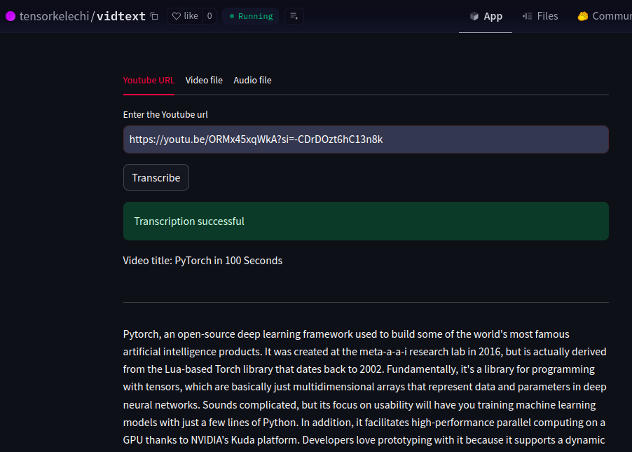
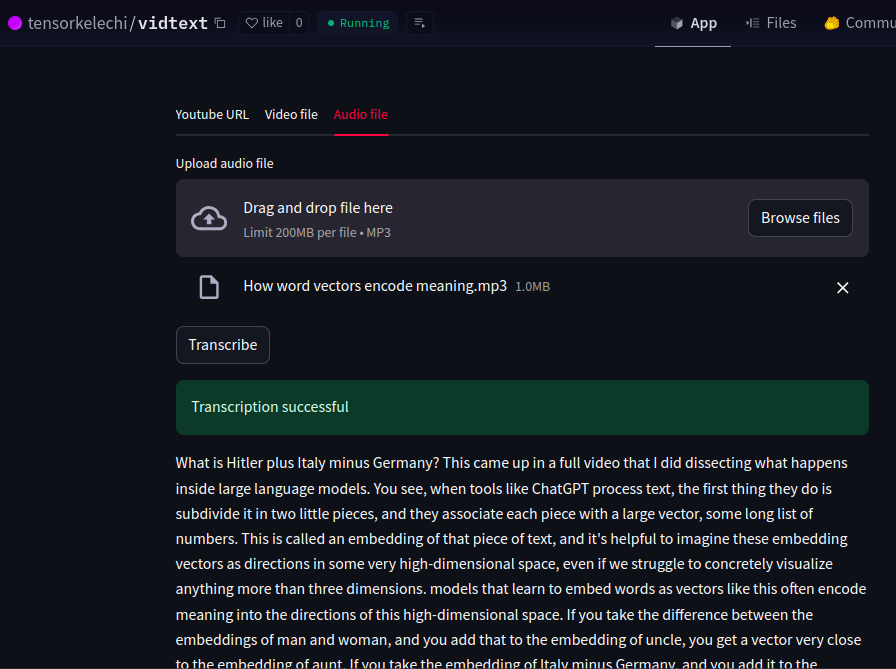

# Vidtext

### Description
An AI project/web app for transcribing video and audio files, even youtube videos (using video link). It utilizes a pretrained ASR(Automatic Speech Recognition) model, Whisper(by OpenAI), Streamlit for the web UI, and other python libraries for audio processing and model loading. 

**NB**: Larger files and videos take a longer time to transcribe

### Dependencies/Libraries
* **Pytorch** (Deep learning)
* **Ffmpeg** (Audio/video encoding)
* **Pydub** (audio processing)
* **Pytube** (Youtube library)
* **Transformers** (model loading)

Check it out => **[Vidtext]('https://huggingface.co/spaces/tensorkelechi/vidtext?logs=container)** on **HuggingFace**

### Sample screenshots
For youtube links

For file uploads

